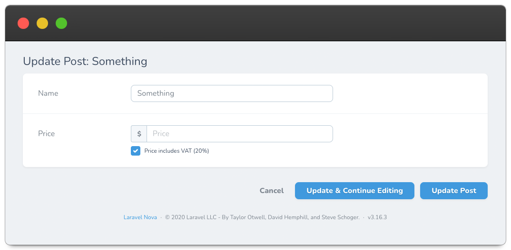

# Nova Simple Repeatable

[](https://packagist.org/packages/optimistdigital/nova-simple-repeatable)
[](https://packagist.org/packages/optimistdigital/nova-simple-repeatable)

This [Laravel Nova](https://nova.laravel.com/) package allows you to create simple horizontal rows of fields that the user can add/remove.

## Requirements

- `php: >=7.2`
- `laravel/nova: ^3.0`

## Features

A Laravel Nova simple repeatable rows field.

## Screenshots



## Installation

Install the package in to a Laravel app that uses [Nova](https://nova.laravel.com) via composer:

```bash
composer require optimistdigital/nova-simple-repeatable
```

## Usage

```php
use OptimistDigital\NovaSimpleRepeatable\SimpleRepeatable;

public function fields(Request $request) {
    SimpleRepeatable::make('Users', 'users', [
        Text::make('First name'),
        Text::make('Last name'),
        Email::make('Email'),
      ])
      ->canAddRows(true) // Optional, true by default
      ->canDeleteRows(true), // Optional, true by default
}
```

## Localization

The translations file can be published by using the following publish command:

```bash
php artisan vendor:publish --provider="OptimistDigital\NovaSimpleRepeatable\SimpleRepeatableServiceProvider" --tag="translations"
```

You can then edit the strings to your liking.

## Credits

- [Tarvo Reinpalu](https://github.com/tarpsvo)

## License

Nova Simple Repeatable is open-sourced software licensed under the [MIT license](LICENSE.md).
